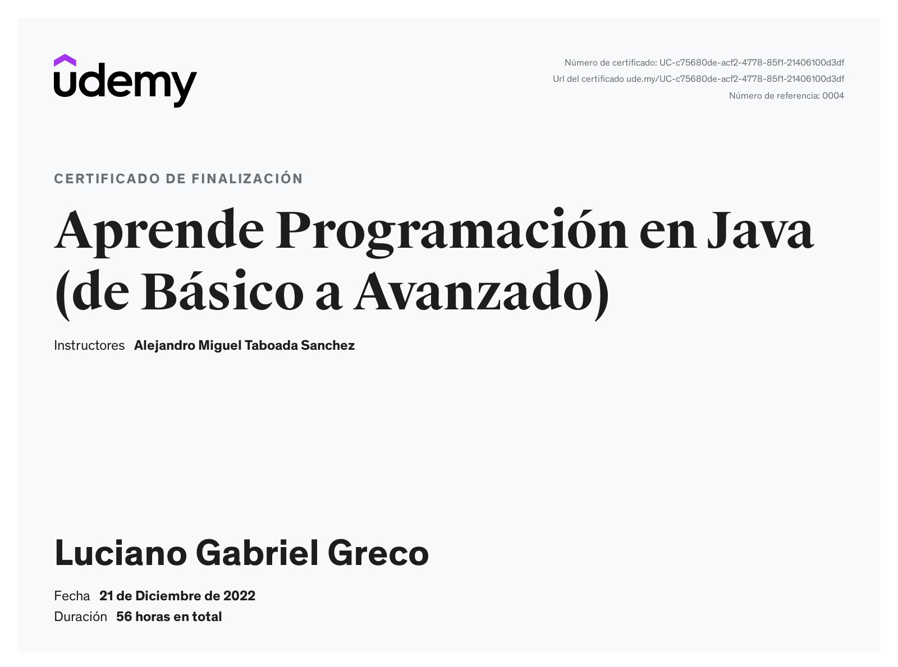
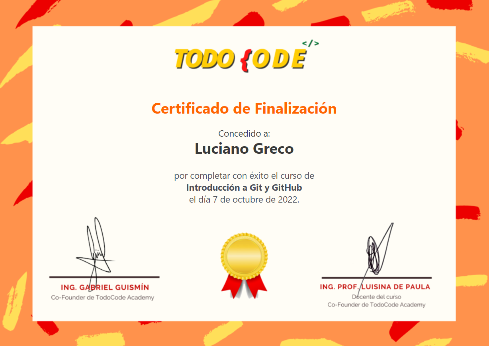

**FULL STACK DEVELOPER**
========================

**Nombre:** Luciano Gabriel
**Apellido:** Greco 
**Fecha de Nacimiento:** 1992
**Localidad:** San Rafael - Mendoza
**Nacionalidad:** Argentina
**Profesion:** Desarrollador Full Stack

*The Certified Tech Developer* 
===============================

> [!IMPORTANT]
> Avalado por las firmas: Digital House > Globant > Mercado Libre

**TECNOLOGíAS Y APLICACIONES**
==============================

 
 

**Luciano Gabriel Greco - Full Stack Developer**

